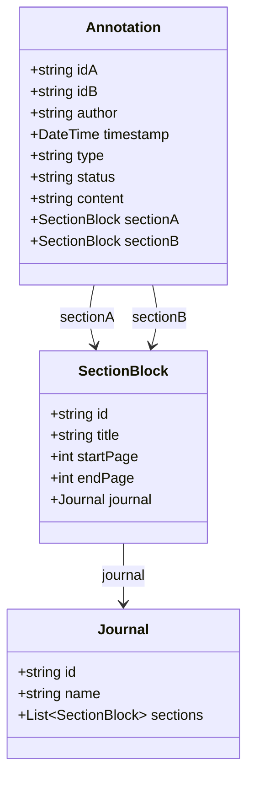
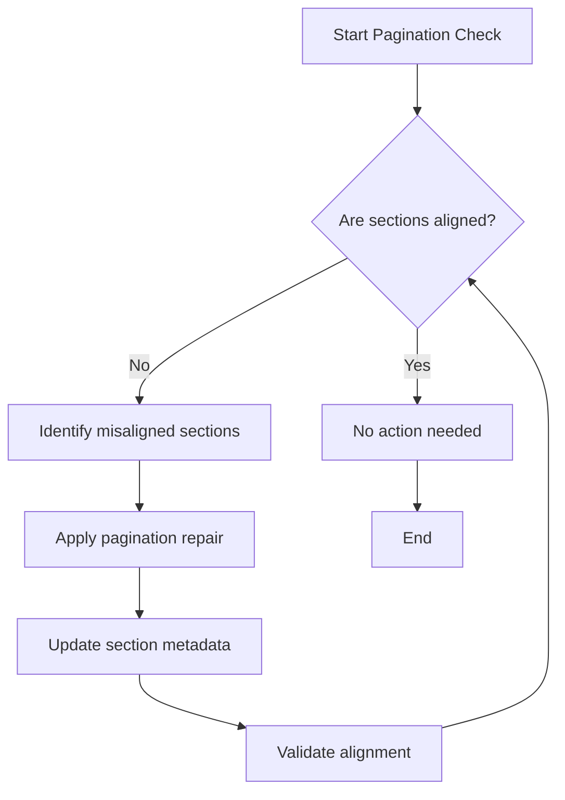
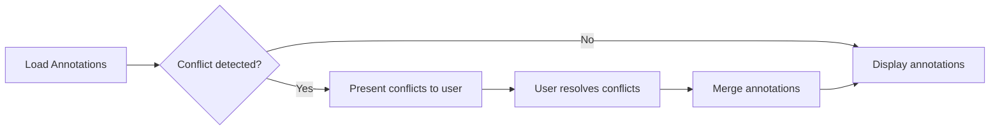

# ADR-002: Two-AID Model and Enhanced Annotation Workflows

## Status

Proposed

## Context

The jvb-parallel-viewer project requires a robust architecture to handle parallel viewing of multiple scanned 1950's Vietnamese Buddhist Journals edited by Thích Nhất Hạnh, displaying OCR text, translations, and images in parallel with complex annotation and reconciliation workflows. The existing model needs enhancements to support:

- Two-AID (Annotation ID) model for better tracking of annotations across multiple journals.
- Section blocks to organize journal content into manageable segments.
- Improved annotation data structures for richer metadata.
- Pagination repair mechanisms to maintain alignment between journal volumes.
- Reconciliation workflows to resolve conflicts and merge annotations effectively.

## Decision

We adopt a two-AID model where each annotation is identified by a pair of IDs corresponding to the two journals being compared. This allows precise tracking and linking of annotations across both journals.

### Section Blocks

Journals will be divided into section blocks representing logical segments such as pages or groups of pages. Each section block will have metadata to facilitate navigation and synchronization.

### Annotation Structure

Annotations will include:

- Unique two-AID identifiers.
- Metadata fields such as author, timestamp, type, and status.
- Links to section blocks in both journals.
- Support for hierarchical annotations and replies.

### Pagination Repair

A mechanism will be implemented to detect and repair pagination misalignments between journal volumes, ensuring that sections correspond correctly and annotations remain valid.

### Reconciliation Workflows

We will define workflows to:

- Detect conflicting annotations.
- Merge annotations based on rules or user input.
- Track reconciliation history and status.

### Diagrams

Mermaid diagrams will be used to visualize the data models and workflows for clarity.

## Consequences

- Improved annotation tracking and synchronization.
- Enhanced user experience with clear sectioning and pagination.
- Better conflict resolution and annotation merging.
- Increased complexity in data management requiring careful implementation.

---

## Mermaid Diagrams

### Two-AID Annotation Model

### Pagination Repair Workflow

### Reconciliation Workflow

---

## Summary

This ADR establishes a comprehensive approach to managing annotations and journal synchronization in jvb-parallel-viewer by introducing a two-AID model, section blocks, enhanced annotation metadata, pagination repair, and reconciliation workflows, supported by clear diagrams and structured processes.
